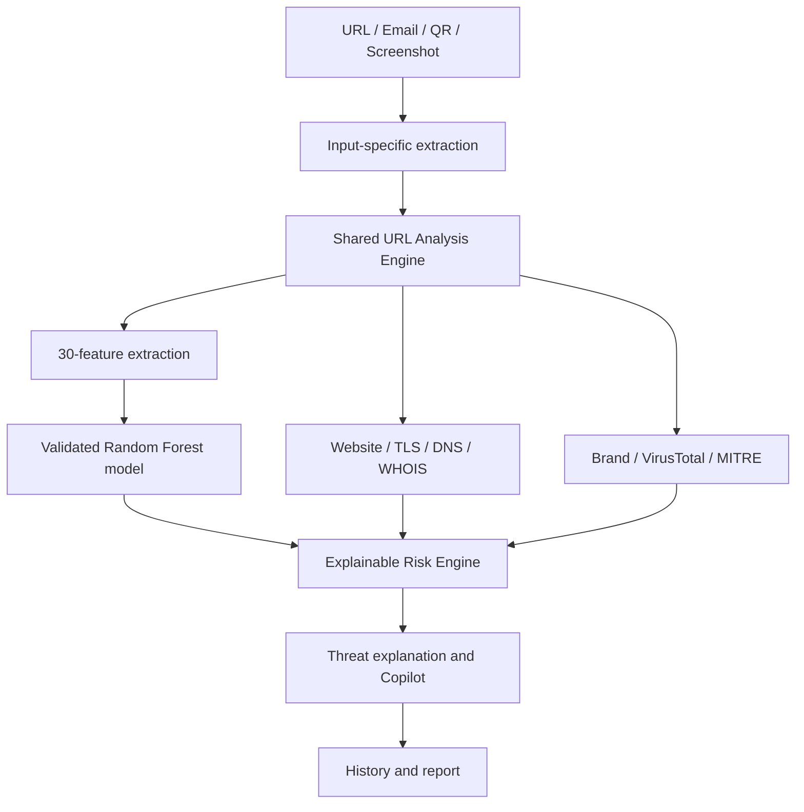

# PhishShield AI


PhishShield AI is a Streamlit phishing-detection and threat-intelligence
platform. It combines a versioned 30-feature URL ML classifier with separate
email analysis, QR decoding, screenshot OCR, brand-impersonation detection,
website/TLS inspection, VirusTotal and WHOIS enrichment, MITRE mapping, AI
security explanations, scan history, and downloadable reports.

The built-in Copilot is an evidence-grounded, deterministic explanation engine;
it is not presented as a generative AI service. It distinguishes collected
evidence from its recommendations and does not invent intelligence findings.

## Overview

PhishShield AI accepts URLs, email text, QR codes, and screenshots. URL-bearing
inputs converge on one shared URL-analysis engine; non-URL modalities retain
their own extraction and indicator logic. External intelligence is always shown
as available, optional, or unavailable—never fabricated.

## Key features

| Module | Capabilities | Status |
| --- | --- | --- |
| URL Analysis | 30-feature ML, website, TLS, DNS, WHOIS, brand, MITRE, risk | Available with live sources |
| Email Analysis | Separate artifact validation, URL extraction, indicators | ML unavailable without genuine artifacts |
| QR Analysis | Decode content and route URLs to shared analysis | Available |
| Screenshot Analysis | OCR, URL extraction, local scam indicators | Available; OCR dependency required |
| Threat Intelligence | WHOIS, DNS, TLS, website, optional VirusTotal | Provider/network dependent |
| History and Reports | Persistent history and downloadable text reports | Available |

## Architecture



## Complete feature architecture

```
URL ─┬─> 30-feature ML ─> prediction/confidence ─┬─> brand detection
     │                                            ├─> SSL + website analysis
     │                                            ├─> VirusTotal + WHOIS
     │                                            ├─> threat explanation + AI copilot
     │                                            └─> risk, history, report
QR ──> decode URL ────────────────────────────────┘
Screenshot ─> OCR URL extraction ─────────────────┘
Email ─> separate email ML (when legitimate artifact is supplied)
      └> URL extraction ─> same complete URL pipeline
```

The recovered UCI dataset is used **only** to train the URL model. It is never
used for email prediction, QR decoding, screenshot OCR, history, reports,
VirusTotal, WHOIS, brand detection, or AI copilot behavior.

## URL ML model

The bundled artifact at `models/artifacts/url_lexical_detector.joblib` is a
3.21 MB Random Forest trained on all 30 UCI Phishing Websites features. It uses
schema `uci-all-30-v1`; the loader rejects corrupt artifacts or models that do
not expect exactly 30 features.

Training and inference feature definitions, sources, encoding, network needs,
and unavailable-source behavior are documented in
[models/FEATURE_SCHEMA.md](models/FEATURE_SCHEMA.md). The application never
fills missing signals with made-up values: a 30-feature score requires webpage,
TLS, DNS, WHOIS, and intelligence-provider data.

Normal users never need `dataset.csv` or to run training. It is a maintainer
asset only and must not be committed.

### Held-out benchmark evaluation

| Metric | Value |
| --- | ---: |
| Accuracy | 94.08% |
| Precision | 95.06% |
| Recall | 93.38% |
| F1 | 94.21% |
| ROC-AUC | 98.87% |

Confusion matrix: TN 403, FP 22, FN 30, TP 423. These are held-out historical
benchmark results; they do not guarantee equivalent real-world performance.

## Email analysis

Email ML is deliberately separate from URL ML. The URL dataset is never used to
train it. Until genuine, versioned email model/vectorizer artifacts are supplied,
the app reports email ML as unavailable rather than fabricating a prediction.
It still identifies URLs in email and routes them to the complete URL pipeline
when the URL intelligence sources are available.

## Threat intelligence and risk scoring

DNS resolution, TLS/website inspection, WHOIS, brand similarity, VirusTotal,
and the optional intelligence provider remain enrichment layers rather than
replacements for the ML classifier. The risk engine records its contributing
signals and maps scores to LOW, MEDIUM, HIGH, and CRITICAL. Unavailable sources
are not counted as safe results.

MITRE ATT&CK mappings are deterministic and evidence-driven: no technique is
returned when the observed URL/risk/brand signals do not support one.

## Installation

```powershell
git clone https://github.com/Ishita-rastogi06/Phis-ShieldAI.git
cd Phis-ShieldAI
python -m venv .venv
.\.venv\Scripts\Activate.ps1
python -m pip install -r requirements.txt
streamlit run app.py
```

## Configuration

Copy `.env.example` to `.env`; never commit it.

```env
# Optional URL enrichment
VIRUSTOTAL_API_KEY=

# Optional external artifact hosting
URL_MODEL_URL=
EMAIL_MODEL_URL=
EMAIL_VECTORIZER_URL=

```

The bundled 30-feature UCI artifact is legacy conditional telemetry: its five
historical popularity/index/backlink features are not fabricated for arbitrary
URLs. VirusTotal, URLhaus, OpenPhish, urlscan, WHOIS, DNS, TLS and passive
website inspection remain independent evidence sources.

## Maintainer retraining

```powershell
python -m training.train_url_model --dataset C:\path\to\dataset.csv
```

The process removes exact duplicate rows before a deterministic stratified
70/15/15 split, compares logistic regression, gradient boosting, and random
forest, selects by validation phishing F1 then recall, and writes the artifact
and [evaluation report](reports/model_evaluation.md). Runtime never trains.

## Project structure

```
app.py                             Streamlit interface
analysis/url_analysis_pipeline.py  Shared full URL-analysis orchestration
ml/url_detector.py                 30-feature URL model inference
ml/email_detector.py               Separate email ML inference
feature_extractor.py               30-feature URL/page/DNS/WHOIS extractor
models/                            artifact manager and feature-schema docs
qr_analyzer.py                     QR content decoding
image_analyzer.py                  Screenshot OCR and scam indicators
brand_detector.py                  Brand impersonation analysis
website_analyzer.py                Website metadata/TLS analysis
tls_intelligence.py                 Certificate/TLS inspection
dns_intelligence.py                 A/AAAA/MX/NS DNS intelligence
virustotal_scanner.py              Optional reputation enrichment
whois_checker.py                   WHOIS enrichment
history_manager.py                 Scan history
report_generator.py                Downloadable reports
```

## Limitations

The 30-feature benchmark is historical. Complete live scoring needs access to
the target page, DNS, WHOIS, and the configured intelligence provider; when one
is unavailable, PhishShield reports the missing source and does not fabricate a
model result. This is a decision-support tool, not a replacement for a secure
web gateway or incident-response process.
