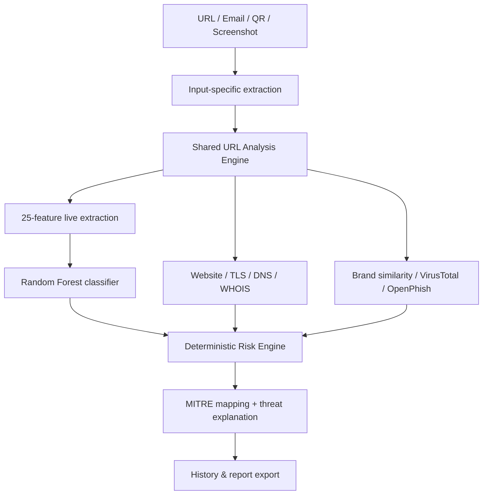

# PhishShield AI


**PhishShield AI** is a real-time phishing detection and threat-intelligence platform built with Streamlit. It combines a **25-feature live Random Forest URL classifier** with active threat-intelligence lookups (VirusTotal, OpenPhish), email analysis, QR code decoding, screenshot OCR, brand-impersonation detection, DNS/TLS/WHOIS enrichment, MITRE ATT&CK mapping, and downloadable scan reports.

The model ships **pre-trained** — no dataset download or training step is required to run the app.

---

## Table of Contents

- [Overview](#overview)
- [Tech Stack](#tech-stack)
- [Key Features](#key-features)
- [Architecture](#architecture)
- [Model Performance](#model-performance)
- [Quick Start](#quick-start)
- [Configuration](#configuration)
- [Project Structure](#project-structure)
- [Retraining (Optional)](#retraining-optional)
- [Known Limitations](#known-limitations)
- [Roadmap](#roadmap)
- [License](#license)

---

## Overview

PhishShield AI accepts a **URL, raw email text, QR code image, or screenshot**. Every modality that contains a URL extracts it and routes it through one shared analysis pipeline:

1. **25 live-collectible structural/DOM/TLS/DNS/WHOIS features** are extracted from the actual live target — nothing is guessed or hard-coded.
2. A Random Forest classifier (`uci-live-25-v1` schema) scores the URL.
3. Independent enrichment layers — DNS, TLS/certificate inspection, WHOIS, brand-similarity detection, VirusTotal, and OpenPhish — add corroborating (or contradicting) evidence.
4. A deterministic, evidence-grounded risk engine combines all signals into a LOW / MEDIUM / HIGH / CRITICAL verdict with a MITRE ATT&CK technique mapping.

If a required live source is unreachable, the app reports that source as **unavailable** rather than fabricating a result.

---

## Tech Stack

| Layer | Technology |
| --- | --- |
| Language | Python 3.13 |
| UI / App Framework | Streamlit |
| Machine Learning | scikit-learn (Random Forest), joblib |
| Database / Persistence | SQLite3 (local persistent DB with per-browser cookie isolation) |
| Data Handling | pandas, NumPy |
| Charts | Plotly |
| Web / Network | requests, BeautifulSoup4, dnspython, python-whois, tldextract |
| QR Decoding | ZXing-C++, PyZbar, OpenCV (fallback chain) |
| Screenshot OCR | EasyOCR (PyTorch backend) |
| PDF Reports | ReportLab |
| Threat Intelligence | VirusTotal API v3, OpenPhish feed |
| Testing | pytest |

---

## Key Features

| Module | Capability | Status |
| --- | --- | --- |
| **Live URL Analysis** | 25-feature Random Forest ML, website/DOM inspection, TLS certificate, DNS resolution, WHOIS domain age, brand similarity, MITRE mapping | Active |
| **Threat Intelligence** | VirusTotal (`GET` fast path, `POST` + poll fallback) and OpenPhish feed lookups | Active, requires API key |
| **Email Analysis** | URL/link extraction from email text, header/body indicator checks, routes URLs to the shared pipeline | Active — dedicated email ML model not bundled |
| **QR Code Analysis** | Multi-engine decode (ZXing-C++ → PyZbar → OpenCV fallback chain), WiFi/vCard/plain-text payload handling, URL routing | Active |
| **Screenshot Analysis** | OCR text extraction (EasyOCR), URL extraction, local scam-indicator scoring | Active |
| **History & Reports** | In-session scan history, downloadable text/PDF reports | Active — see [Known Limitations](#known-limitations) |

---

## Architecture



---

## Model Performance

The bundled artifact `models/artifacts/url_live_25_detector.joblib` is a Random Forest (300 estimators) trained on the UCI Phishing Websites dataset (OpenML ID 4534), using 25 of the original 30 features — the 5 features that depend on discontinued services (Alexa web traffic rank, Google PageRank, Google index, backlink count, statistical report) were dropped so the model only ever uses signals that can genuinely be collected live.

### Held-out test metrics

| Metric | Value |
| --- | ---: |
| Accuracy | 94.08% |
| Phishing Precision | 93.95% |
| Phishing Recall | 92.49% |
| Phishing F1 | 93.21% |
| ROC-AUC | 98.20% |

Confusion matrix (held-out set): TP 419, TN 398, FP 27, FN 34.

> **Important:** these are benchmark metrics on a historical, held-out academic dataset (OpenML 4534). They demonstrate the model was trained and validated correctly, but they are **not a guarantee of equivalent accuracy on live, real-world URLs** — phishing patterns evolve over time. This is why the app never scores on ML alone; DNS, TLS, WHOIS, brand-similarity, and VirusTotal/OpenPhish signals are combined with the model output in the final risk decision.

A legacy 30-feature artifact was previously bundled for a dashboard feature-importance visualization, but has been removed to keep a single source of truth — the feature-importance chart now reads directly from the same 25-feature model used for live scoring.

---

## Quick Start

```powershell
git clone https://github.com/Ishita-rastogi06/Phis-ShieldAI.git
cd Phis-ShieldAI
python -m venv .venv
.\.venv\Scripts\Activate.ps1
python -m pip install -r requirements.txt
streamlit run app.py
```

macOS/Linux users also need the system `zbar` shared library for QR decoding fallback:

```bash
# Debian/Ubuntu
sudo apt-get install libzbar0
# macOS
brew install zbar
```

No dataset download and no training step is needed — the trained model artifacts are committed to the repository and load automatically.

---

## Configuration

Copy `.env.example` to `.env` and add your keys. **Never commit `.env`.**

```env
# Optional — enables VirusTotal enrichment. Without it, VirusTotal shows
# as "NOT CONFIGURED" rather than being silently skipped.
VIRUSTOTAL_API_KEY=

# Optional — only needed if you host model artifacts externally instead
# of using the bundled ones in models/artifacts/.
URL_MODEL_URL=
EMAIL_MODEL_URL=
EMAIL_VECTORIZER_URL=
```

---

## Project Structure

```
app.py                             Streamlit interface
analysis/url_analysis_pipeline.py  Shared full URL-analysis orchestration
ml/url_detector.py                 Live 25-feature Random Forest inference
ml/email_detector.py               Email content parsing
feature_extractor.py               25-feature live URL/page/DNS/WHOIS extractor
models/                            Artifact manager, schema config, artifacts
qr_analyzer.py                     QR decoding (ZXing-C++ / PyZbar / OpenCV)
image_analyzer.py                  Screenshot OCR (EasyOCR) + scam indicators
brand_detector.py                  Brand-impersonation similarity detection
website_analyzer.py                Live webpage/DOM analysis
tls_intelligence.py                Certificate/TLS inspection
dns_intelligence.py                DNS resolution intelligence
virustotal_scanner.py              VirusTotal enrichment (optional)
whois_checker.py                   WHOIS/domain-age enrichment
mitre_mapper.py                    MITRE ATT&CK technique mapping
history_manager.py                 In-session scan history
report_generator.py                Downloadable report generation
security/                          SSRF protection & input validation
intelligence/                      Provider adapters (OpenPhish, etc.)
training/train_live_25_model.py    Retraining script (optional, maintainers only)
```

---

## Retraining (Optional)

Normal usage of this app **never requires retraining** — this section is only for maintainers who want to reproduce or update the model.

```powershell
python -m training.train_live_25_model
```

This fetches OpenML dataset 4534, removes exact duplicate rows, performs a deterministic stratified 70/15/15 split, compares logistic regression / gradient boosting / random forest, selects by validation phishing F1 then recall, and overwrites `models/artifacts/url_live_25_detector.joblib` and `reports/model_evaluation_live_25.md`.

---

## Known Limitations

- **Scan history is stored locally per-browser via SQLite + cookie.** History is persisted in `history.db` using a 1-year browser cookie identifier (`phishshield_user_id`), isolating each user's history locally across browser refreshes and server restarts without syncing across different devices or browsers.
- **Email ML classifier is not bundled.** Email analysis extracts and scores embedded URLs through the same live pipeline, but there is no dedicated trained email classifier yet.
- **Model accuracy is a historical benchmark**, not a live-world guarantee (see [Model Performance](#model-performance)).
- **Live scoring depends on network reachability.** If the target page, DNS, WHOIS, or VirusTotal cannot be reached, that source is reported as unavailable rather than assumed safe.

This is a decision-support tool intended for a college ML/security project — not a replacement for a production secure web gateway or incident-response process.

---

## Roadmap

- [x] Persistent per-user scan history (SQLite + browser-scoped identifier)
- [ ] Parallelized threat-intelligence lookups for faster scans
- [ ] Dedicated email phishing classifier
- [ ] Dockerized deployment

---

## License

MIT — see `LICENSE`.